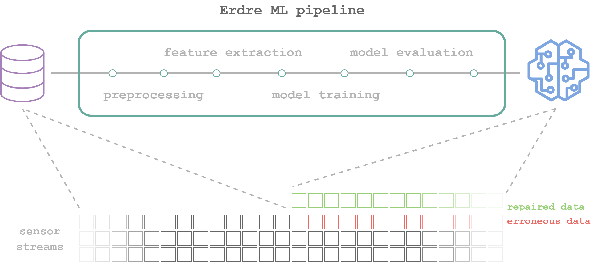

# Erdre

Erroneous data repair for Industry 4.0.

This is a project using [DVC](https://dvc.org/) for setting up a flexible and
robust pipeline for machine learning experiments.

In order to get started with Erdre, read our documentation:

1. [Installation](https://github.com/SINTEF-9012/Erdre/blob/master/docs/tutorials/01_installation.md)
2. [Quickstart](https://github.com/SINTEF-9012/Erdre/blob/master/docs/tutorials/02_quickstart.md)
3. [Overview of pipeline](https://github.com/SINTEF-9012/Erdre/blob/master/docs/tutorials/03_pipeline.md)

